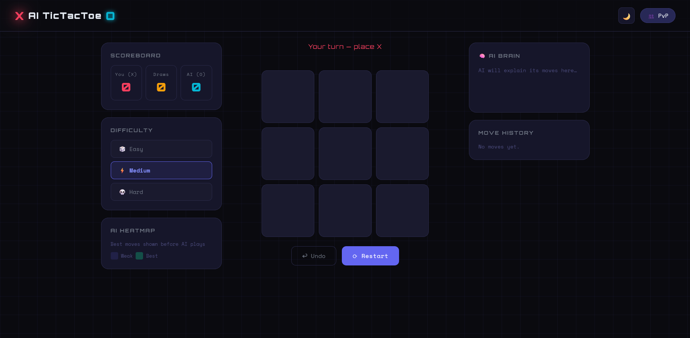
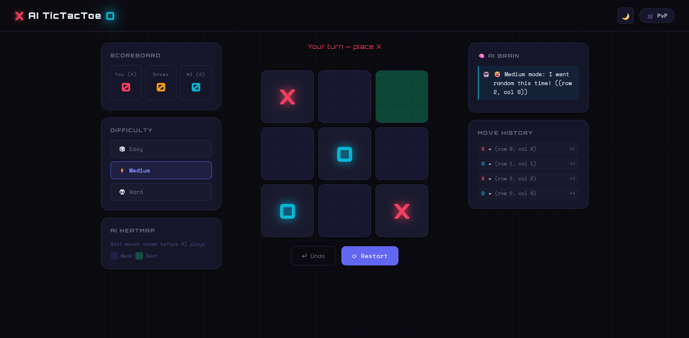
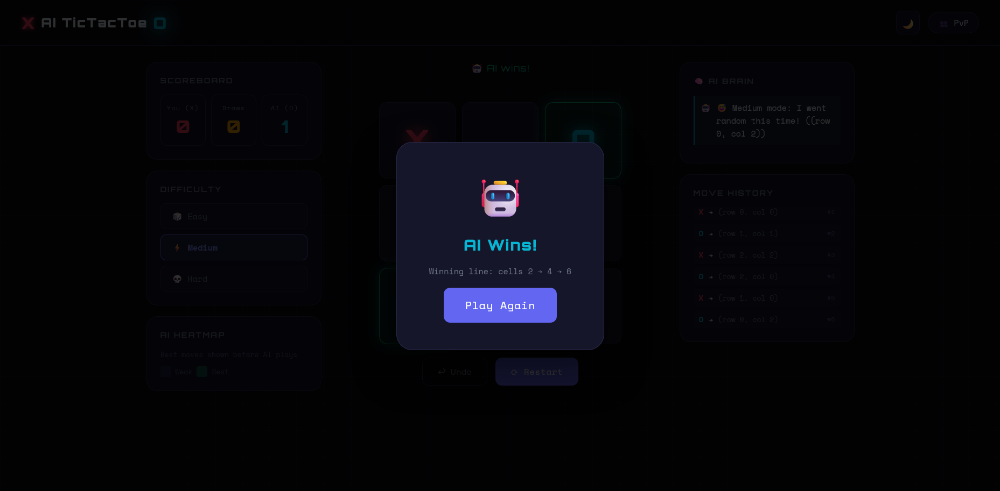
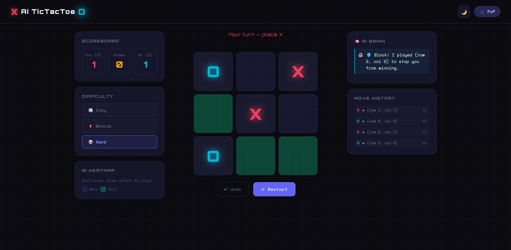

# 🤖 AI Tic Tac Toe — Minimax Algorithm

 A feature-rich, visually polished Tic Tac Toe game with an AI powered by the Minimax algorithm with Alpha-Beta pruning.



---

## 🎮 Live Demo

> Open `index.html` in any modern browser — no setup, no build, no server needed.

---

## ✨ Features

### 🎯 Core Gameplay
- 3×3 interactive game board — click to place X or O
- **Player vs AI** and **Player vs Player** modes
- Win detection — rows, columns, diagonals
- Draw detection
- Instant restart

### 🧠 AI Intelligence
| Difficulty | Strategy |
|-----------|---------|
| 🎲 Easy | Fully random moves |
| ⚡ Medium | 60% optimal, 40% random |
| 💀 Hard | **Unbeatable** — perfect Minimax + Alpha-Beta pruning |

### 🔥 Standout Features
- **AI Explanation Mode** — after each move, the AI tells you *why* it chose that cell  
  - "I blocked your winning move"
  - "Fork detected — two threats at once!"
  - "Center control gives me the most paths"
- **Move Heatmap** — color-coded overlay shows which cells are hottest for the AI
- **Move History** — full log of every move with coordinates `X → (row 1, col 1)`
- **Undo Move** — step back one turn (both player + AI moves in PvA)
- **Scoreboard** — tracks Player wins, AI wins, and Draws across sessions
- **Realistic AI Delay** — 0.7–1.5s thinking pause with animated dots
- **AI Learning** (basic) — tracks your favourite cells and occasionally counters them
- **Dark / Light Mode** — toggle with 🌙/☀️, saved to localStorage
- **Win Line Highlight** — winning cells flash with a glowing green animation
- **Smooth animations** — pop-in marks, hover effects, overlay zoom

---

## 📁 File Structure

```
ai-tictactoe/
│
├── index.html          # Main HTML — layout & markup
│
├── css/
│   └── style.css       # All styling — themes, animations, responsive
│
├── js/
│   ├── ai.js           # AI logic (Minimax, heatmap, explanations)
│   ├── game.js         # Game state, turns, win detection, undo
│   └── ui.js           # DOM manipulation, events, animations
│
└── README.md           # This file
```

---

## 🧠 How the AI Works

### Minimax Algorithm
The Hard AI uses the classic **Minimax** algorithm — it simulates every possible future game state recursively, assuming both players play optimally. It assigns scores to terminal states:
- AI wins → `+10 - depth` (prefer faster wins)
- Player wins → `depth - 10` (prefer slower losses)
- Draw → `0`

### Alpha-Beta Pruning
Minimax is enhanced with **Alpha-Beta pruning**, which cuts branches that can't possibly affect the final decision. This makes the AI significantly faster without changing the result.

```
minimax(board, depth, isMaximizing, alpha, beta)
  → if terminal state: return score
  → for each empty cell:
       simulate move → recurse → undo move
       prune if alpha >= beta
```

### Move Explanation Logic
After each AI move, the game checks (in order):
1. Did the AI just win? → "Winning move"
2. Did the AI block your win? → "Blocked!"
3. Did the AI take the center? → "Center control"
4. Did the AI take a corner? → "Corner strategy"
5. Did the AI create a fork (2+ threats)? → "Fork!"
6. Otherwise → "Minimax optimal"

### Heatmap
Before the AI plays, each empty cell is scored using Minimax and normalized to a 1–3 heat level, then shown as a colour overlay on the board.

---

## 🚀 Getting Started

```bash
# Clone the repo
git clone https://github.com/yourusername/ai-tictactoe.git
cd ai-tictactoe

# Open in browser
open index.html
# or just double-click index.html
```

No npm, no bundler, no framework — pure HTML, CSS, and JS.

---

## 🎨 Design Highlights

- **Font**: Orbitron (headings) + Space Mono (body) — terminal / cyberpunk feel
- **Theme**: Dark cyberpunk grid with light mode toggle
- **Color system**: CSS variables for full theme switching
- **Animations**: CSS keyframes for pop-in, win-flash, bounce, zoom, slide-in
- **Responsive**: Adapts to tablet and mobile layouts

---

## 🛠️ Tech Stack

| Technology | Usage |
|-----------|-------|
| HTML5 | Semantic structure |
| CSS3 | Variables, animations, Grid, Flexbox |
| Vanilla JS | Game logic, AI, DOM manipulation |
| Google Fonts | Orbitron + Space Mono |
| localStorage | Theme persistence |

---

## 🤝 Contributing

1. Fork the repo
2. Create a feature branch: `git checkout -b feature/my-feature`
3. Commit: `git commit -m "Add my feature"`
4. Push: `git push origin feature/my-feature`
5. Open a Pull Request

---

## 📄 License

MIT © 2026 — feel free to use, modify, and share.
